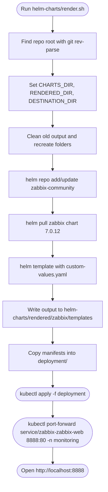

# Zabbix-JR Local Development Process

## Overview

This document describes the current local workflow: render manifests, apply them, and access Zabbix Web through port-forwarding.

---

## Flow Chart



---

## Step-by-Step Breakdown

### 1) Render script behavior (`helm-charts/render.sh`)

The render script:

- Pins chart version to `7.0.12`
- Resets and recreates `helm-charts/charts`, `helm-charts/rendered`, and `deployment`
- Pulls `zabbix-community/zabbix`
- Renders YAML using `helm-charts/custom-values.yaml`
- Copies rendered templates into `deployment/`

### 2) Apply resources

Use:

```sh
kubectl apply -f deployment
```

### 3) Verify resources

Use:

```sh
kubectl get pods -n monitoring
kubectl get svc -n monitoring
```

### 4) Access Zabbix Web locally

Use:

```sh
kubectl port-forward service/zabbix-zabbix-web 8888:80 -n monitoring
```

Then open:

```text
http://localhost:8888
```

### 5) Clean up

Use:

```sh
kubectl delete -f deployment
```

---

## Notes

- `render.sh` sets Helm namespace from lowercase `$USER` during template rendering.
- Operational commands in this local workflow use `-n monitoring`.
- If resources are not found in `monitoring`, inspect namespaces with `kubectl get ns` and adjust commands accordingly.
