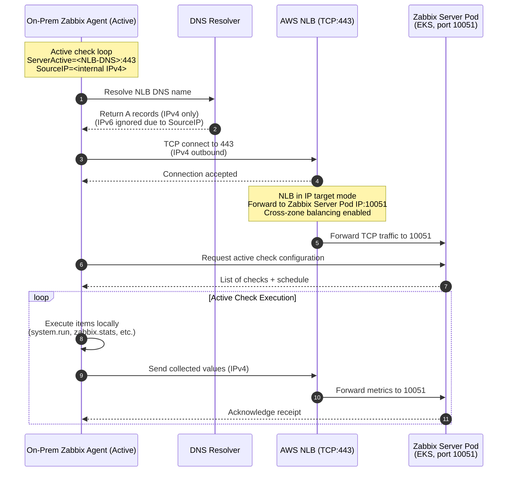

# Metrics flow from Zabbix Union to Zabbix Jr

```mermaid
    sequenceDiagram
    autonumber

    participant Agent as On‑Prem Zabbix Agent (Active)
    participant DNS as DNS Resolver
    participant NLB as AWS NLB (TCP:443)
    participant Pod as Zabbix Server Pod<br>(EKS, port 10051)

    Note over Agent: Active check loop<br>ServerActive=<NLB-DNS>:443<br>SourceIP=<internal IPv4>

    Agent->>DNS: Resolve NLB DNS name
    DNS-->>Agent: Return A records (IPv4 only)<br>(IPv6 ignored due to SourceIP)

    Agent->>NLB: TCP connect to 443<br>(IPv4 outbound)
    NLB-->>Agent: Connection accepted

    Note over NLB: NLB in IP target mode<br>Forward to Zabbix Server Pod IP:10051<br>Cross-zone balancing enabled

    NLB->>Pod: Forward TCP traffic to 10051

    Agent->>Pod: Request active check configuration
    Pod-->>Agent: List of checks + schedule

    loop Active Check Execution
        Agent->>Agent: Execute items locally<br>(system.run, zabbix.stats, etc.)
        Agent->>NLB: Send collected values (IPv4)
        NLB->>Pod: Forward metrics to 10051
        Pod-->>Agent: Acknowledge receipt
    end
```
